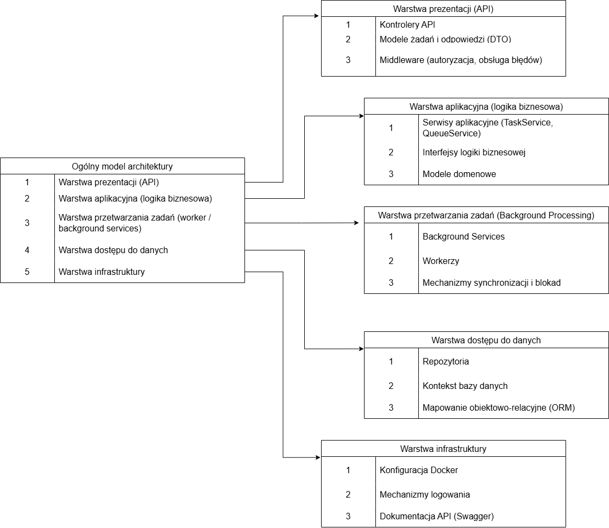

# QueueManager

QueueManager to prosta aplikacja do zarządzania kolejką zadań z możliwością wyboru strategii priorytetyzacji przez użytkownika. Pozwala dodawać, edytować i usuwać zadania oraz ustalać ich kolejność wykonywania w zależności od wybranego trybu, np. **FIFO**, **LIFO**, **priorytet 1–10**, **SJF (Shortest Job First)**, **LJF (Longest Job First)**, **RR (Round Robin)** oraz **Random/Shuffle**.

Projekt sprawdza się w organizacji pracy, planowaniu oraz obsłudze procesów wymagających elastycznego kolejkowania zadań. Może być integrowany z innymi systemami i aplikacjami w celu automatyzacji przepływu pracy.

---

## 📌 Informacje ogólne

- **Nazwa projektu:** QueueManager  
- **Typ aplikacji:** Backend / REST API (ASP.NET Core Web API)  
- **Cel:** zarządzanie kolejką zadań oraz ich przetwarzanie w tle  
- **Autorzy:** Patryk Pisarek, Jakub Kruźlak, Szymon Suchanek  
 

---

## 📝 Opis programu

QueueManager to aplikacja backendowa służąca do zarządzania kolejkowaniem oraz przetwarzaniem zadań w sposób uporządkowany, kontrolowany i skalowalny. System został zaprojektowany z myślą o scenariuszach, w których wiele zadań musi być realizowanych asynchronicznie, zgodnie z ustalonymi zasadami kolejności oraz priorytetów.

Głównym celem aplikacji jest umożliwienie dodawania, modyfikowania, usuwania oraz monitorowania zadań, które trafiają do kolejki przetwarzania. System wspiera różne strategie kolejkowania, takie jak FIFO (First In, First Out) oraz LIFO (Last In, First Out), a także uwzględnia priorytety zadań, co pozwala na elastyczne sterowanie kolejnością ich realizacji. Dla zadań o tym samym priorytecie zachowana jest deterministyczna kolejność przetwarzania.

Aplikacja automatycznie pobiera zadania z kolejki i realizuje je w tle, obsługując równoległe przetwarzanie oraz zmiany statusów w całym cyklu życia zadania – od momentu utworzenia, przez przetwarzanie, aż po zakończenie lub wystąpienie błędu. W przypadku niepowodzenia możliwe jest ponowne przetworzenie zadania bez wpływu na stabilność całego systemu.

System udostępnia również funkcje monitorowania i podglądu, umożliwiające użytkownikom śledzenie aktualnego stanu kolejki, listy aktywnych i zakończonych zadań oraz historii ich przetwarzania. Dzięki temu aplikacja może pełnić rolę centralnego mechanizmu kolejkowego wykorzystywanego w większych systemach informatycznych, np. do obsługi procesów wsadowych, zadań backgroundowych lub integracji między systemami.

---

## ✅ Wymagania funkcjonalne

Aplikacja do zarządzania kolejkowaniem zadań umożliwia tworzenie, zarządzanie oraz przetwarzanie zadań w uporządkowany i kontrolowany sposób.

### 1. Zarządzanie zadaniami
- Dodawanie nowych zadań do systemu
- Edycja istniejących zadań
- Usuwanie zadań z kolejki
- Przechowywanie podstawowych informacji o zadaniu:
  - identyfikator
  - nazwa
  - opis
  - priorytet
  - status
  - data utworzenia

### 2. Obsługa kolejki
- Umieszczanie zadań w kolejce przetwarzania
- Kolejkowanie zadań z uwzględnieniem priorytetów
- Zachowanie kolejności FIFO dla zadań o tym samym priorytecie

### 3. Przetwarzanie zadań
- Automatyczne pobieranie zadań z kolejki do realizacji
- Zmiana statusu zadania w trakcie jego cyklu życia:
  - oczekujące
  - w trakcie przetwarzania
  - zakończone
  - zakończone błędem
- Obsługa ponownego przetwarzania zadań zakończonych błędem

### 4. Monitorowanie i podgląd
- Podgląd aktualnego stanu kolejki
- Wyświetlanie listy aktywnych oraz zakończonych zadań
- Dostęp do historii przetwarzania zadań

---

## ⚙️ Wymagania niefunkcjonalne

### 1. Technologiczne
- Backend aplikacji został zaimplementowany w technologii **.NET**
- Aplikacja udostępnia interfejs API oparty na architekturze **REST**
- Dane aplikacji są przechowywane w **bazie danych**
- Projekt jest wersjonowany przy użyciu **Git** i hostowany w serwisie **GitHub**

### 2. Wydajność
- System obsługuje jednoczesne przetwarzanie wielu zadań
- Operacje dodawania i pobierania zadań z kolejki są zoptymalizowane pod kątem czasu odpowiedzi

### 3. Bezpieczeństwo
- Dostęp do API jest kontrolowany przez **autoryzację**
- Walidacja danych wejściowych zapobiega wprowadzaniu niepoprawnych danych
- Operacje krytyczne są ograniczone do uprawnionych użytkowników

### 4. Równoległość i niezawodność
- System wspiera równoległe przetwarzanie zadań
- Mechanizmy synchronizacji zapobiegają konfliktom przy dostępie do kolejki
- Błędy przetwarzania zadań są rejestrowane i nie blokują całego systemu

---

## 🧩 Funkcjonalności / moduły systemu

System można logicznie podzielić na moduły:

- **Moduł zarządzania zadaniami**
  - tworzenie / edycja / usuwanie
  - przechowywanie metadanych zadania

- **Moduł kolejkowania**
  - umieszczanie zadań w kolejce
  - obsługa strategii kolejkowania i priorytetyzacji

- **Moduł przetwarzania w tle (Background Worker)**
  - automatyczne pobieranie zadań do realizacji
  - równoległe przetwarzanie
  - obsługa retry dla błędnych zadań

- **Moduł monitoringu**
  - podgląd stanu kolejki
  - historia zadań
  - logowanie błędów

- **Moduł API**
  - REST API do integracji z frontendem lub innymi systemami

---

## 👤 Przypadki użycia

### 1. Dodanie nowego zadania
**Aktor:** Użytkownik  
**Opis:**  
Użytkownik dodaje nowe zadanie, określając jego podstawowe parametry. Zadanie zostaje zapisane w systemie i umieszczone w kolejce oczekujących.

### 2. Przetwarzanie zadania
**Aktor:** System  
**Opis:**  
System automatycznie pobiera zadanie z kolejki zgodnie z jego priorytetem i rozpoczyna przetwarzanie. Po zakończeniu status zadania jest aktualizowany.

### 3. Podgląd kolejki
**Aktor:** Użytkownik  
**Opis:**  
Użytkownik przegląda aktualny stan kolejki oraz listę zadań w różnych statusach.

### 4. Obsługa błędu zadania
**Aktor:** System / Administrator  
**Opis:**  
W przypadku błędu podczas przetwarzania zadania system oznacza je jako zakończone błędem i zapisuje informacje diagnostyczne.

---

## 🏗️ Architektura systemu

Projekt zakłada prostą architekturę backendową opartą o REST API + przetwarzanie w tle.

### Uzasadnienie wyboru architektury
Zastosowana architektura:
- spełnia wymagania funkcjonalne systemu kolejkowania
- umożliwia równoległe przetwarzanie zadań
- zapewnia prostą rozbudowę w przyszłości
- jest łatwa w implementacji i zrozumiała
- jest zgodna z technologią .NET oraz REST API

### Diagram (draw.io)

